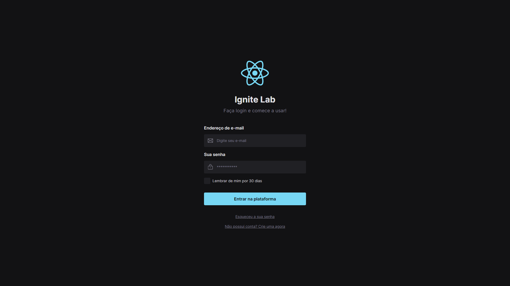

<h1 align="center">Ignite Lab Design System</h1>

<p align="center">
  
  
  <a href="https://github.com/jtiagosantos/ignite-lab-design-system/commits/master">
    
  </a>
  
   <a href="https://github.com/jtiagosantos/ignite-lab-design-system/stargazers">
    
  </a>
</p>

<h4 align="center"> 
	🚧 Ignite Lab Design System 🎨 Completed 🚀 🚧
</h4>

<p align="center">
  <a href="#-features">Features</a> •
  <a href="#-run-project">Run Project</a> • 
  <a href="#-run-storybook">Run Storybook</a> • 
  <a href="#-technologies">Technologies</a> • 
  <a href="#-docs">Docs</a> •
  <a href="#-layout">Layout</a> •
  <a href="#-author">Author</a> • 
  <a href="#-license">License</a>
</p>

<br>

<h1 align="center">
  
</h1>

## ⚙️ Features

- [x] Design System
- [x] Storybook
- [x] CD pipeline (deploy storybook)  
- [x] Composition pattern 

<br>

## 🚀 Run Project

1️⃣ Clone project and access its folder:

```bash
$ git clone https://github.com/jtiagosantos/ignite-lab-design-system.git
$ cd ignite-lab-design-system
```

2️⃣ Install dependencies:

```bash
$ npm i
```

3️⃣ Start project:

```bash
$ npm run dev
```

<br>

## 🚀 Run Storybook

```bash
$ npm run storybook
```

<br>


## 🛠 Technologies

The following tools were used in the construction of project:

- **[Vite](https://vitejs.dev/)**
- **[Typescript](https://www.typescriptlang.org/)**
- **[Tailwindcss](https://tailwindcss.com/)**
- **[Storybook](https://storybook.js.org/docs/react/get-started/introduction)**
- **[Storybook Deployer](https://github.com/storybookjs/storybook-deployer)**
- **[MSW Storybook Addon](https://github.com/mswjs/msw-storybook-addon)**
- **[Storybook Addon Interactions](https://storybook.js.org/addons/@storybook/addon-interactions)**
- **[Storybook Accessibility Addon](https://storybook.js.org/addons/@storybook/addon-a11y)**

<br>

## 📝 Docs

You can view the storybook documentation through the link below:

- **[Storybook](https://jtiagosantos.github.io/ignite-lab-design-system/)**

<br>

## 🔖 Layout

You can view the project layout through the link below:

- **[Layout Web](https://www.figma.com/file/Y1hzGhTnCF4MnmFUzK7vqT/Ignite-Lab-Design-System?node-id=0%3A1)**

<br>

## 👨‍💻 Author


<strong><a href="https://github.com/jtiagosantos">Tiago Santos </a>🚀</strong>

[](https://www.linkedin.com/in/josetiagosantosdelima/)
[](mailto:tiago.santos@icomp.ufam.edu.br)

<br>

## 📝 License

This project is under license [MIT](./LICENSE).
